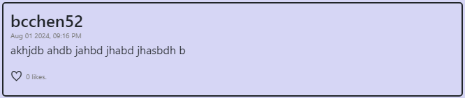
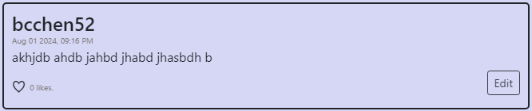
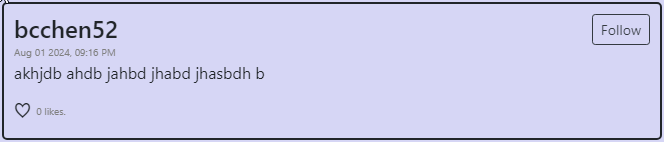
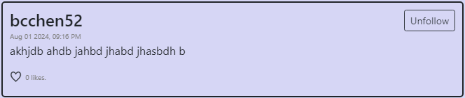
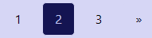

# Network

Network is a single-page Twitter-like social network that allows users to post, follow other users, and interact with posts.

The front-end utilizes JavaScript to interact with posts and CSS to animate elements.

The back-end utilizes Django to create and serve API calls that are used to store and represent post and user data, as well as providing information about the current user and session. 

Network is project 4 from Harvard University's CS50W, and basic login/register/logout functions were included in the starter code. 

#### Table of contents
- [Functionality and Features](#functionality-and-features)
- [Requirements](#requirements)
- [How To Use](#how-to-use)

## Functionality and Features

This project meets all requirements specified by CS50W, listed [here.](https://cs50.harvard.edu/web/2020/projects/4/network/)

This includes...
- All **Posts**, **Following**, and **Profile** pages
    - The **Following** page shows posts of users that the current user follows
- The ability for users to create posts
- The ability for users to edit their own posts
- The ability for users to like and unlike posts
- The ability for users to follow other users
- Pagination to statically load and create responsive page buttons


Additional features include...
- Follow button available and responsive on **Posts** page
- Posts with a load-in animation using CSS animation

___

The Django models used are...
- `User`
- `Profile`
    - Contains information about a user's following/followers
- `Post`
    - Contains information about a post and its likes

When the information in those models is accessed via JavaScript and API calls, additional information is returned to determine what elements should be displayed.

For example, when the `seralize()` method for a `Post` object returns...
```
 return {
    "id": self.id,
    "user": self.user.username,
    "content": self.content,
    "likes": self.get_likes(),
    "num_likes": self.likes.count(),
    "timestamp": timestamp,
    "user_liked": False,
    "owned": False,
    "to_follow": "None",
}
```

The first few keys are populated with information from the `Post` object itself, however, `user_liked`, `owned`, `to_follow`, which determine if the current user has liked the post, owns the post, and follows the person, respectively, is not stored in the Post object itself. 

`user_liked` checks if the current user is in the liked field of the `Post` object to determine the status of the post. 

`owned` checks if the current user is the owner of the `Post` object, which will display an Edit button if the user created that post.

`to_follow` checks if the current user is in the following field of the `Post` object's creater and either displays a follow or unfollow button.

These features also take into account whether or not the user is logged in.

If a user isn't logged in...



If a user is logged in and it is their post...



If a user is logged in, it isn't their post and they aren't following the creator...



If a user is logged in, it isn't their post and they are following the creator...



In addition, the `posts(request, posts_type, page)` method in `network/views.py` uses Django's Pagination feature, which allows for posts to be split up and displayed in groups of ten. This method returns an array of JSON objects with 10 post objects and 1 object with information about the current page, which is used to alter the page buttons and labels on the bottom of the page. 

For example, the JSON object for the third page with four total pages would look like...
```
{ 
    bwd: true,
    fwd: false,
    next: 4,
    prev: 2,
}
```

This results in...




## Requirements

This project requires Django to be installed.

Run

    $ pip install -r requirements.txt

## How To Use

This repository contains an empty Network application. 

Clone and enter the repository.

When running for the first time, create migrations with the following.

    $ python manage.py makemigrations network
    $ python manage.py migrate

After migrations have been created, run the app with 

    $ python manage.py runserver
